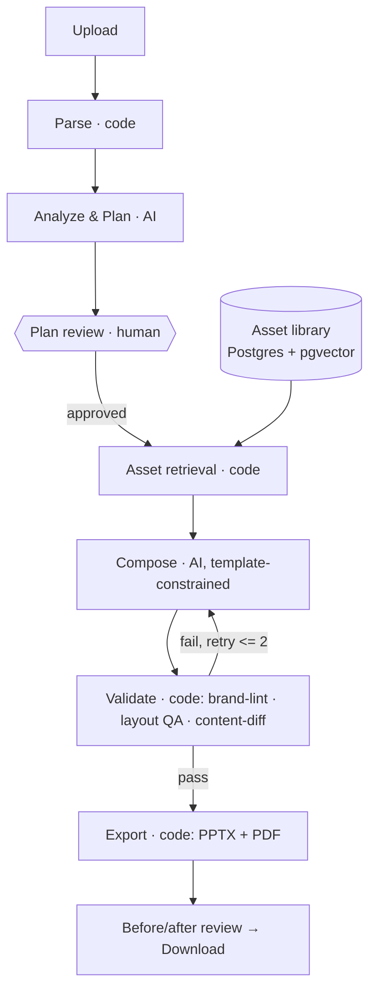

# Architecture — iMocha AI Presentation Studio

> Source of truth for the backend build. Referenced from `CLAUDE.md`. If this file
> and the code ever disagree, this file wins until deliberately updated.

## 1. What this is

A FastAPI backend that transforms an uploaded PowerPoint deck into an on-brand,
fully editable iMocha presentation (PPTX + PDF). A React frontend already exists and
talks to this backend through a typed API client. The user flow: **upload → process →
approve the plan → review before/after → download.**

## 2. Design principles (non-negotiable)

1. **LLM for judgment, code for correctness.** An LLM is used only where genuine
   interpretation or design judgment is needed (understanding content, planning the
   transformation, composing slides). Everything with a single correct answer —
   parsing, asset retrieval/ranking, brand checks, content verification, file
   generation — is deterministic code.
2. **Compliance by construction.** The composer builds slides only from approved
   template primitives, approved colors/fonts, and approved assets. Out-of-brand
   output is not something it can emit. Brand correctness is then *verified* by a
   deterministic linter — never by an LLM grading itself.
3. **Verify, don't trust.** The component that generates content never certifies its
   own output. Brand compliance and content preservation are checked by separate
   deterministic validators.
4. **Human checkpoint before expensive work.** The user approves the transformation
   plan before rendering. Rejections cost a cheap planning step, not a full re-render.

## 3. Pipeline



## 4. LLM vs deterministic — the boundary

| Step | Type | Notes |
|---|---|---|
| Parse PPTX (text, shapes, tables, images, geometry) | **Code** | One correct answer; Aspose / python-pptx. |
| Understand content, classify slide type, extract claims | **AI (multimodal)** | Interpretation of meaning. |
| Decide the transformation plan (layout, restructure, asset needs) | **AI** | Design judgment. |
| Embed assets + build the index | **Code** | Mechanical. |
| Decide *what* asset a slide needs | **AI** | Part of planning. |
| Retrieve + rank assets | **Code** | Filter then vector rank; also how "approved-only" is guaranteed. |
| Decide chart type + insight title | **AI** | Interpretation of the data. |
| Render chart / place objects / apply template | **Code** | Construction from the plan. |
| Brand compliance (fonts/colors/logo/gradients) | **Code** | Exact rules + a guarantee → must be code. |
| Content preservation / diff | **Code** | A promise must be verifiable; never self-graded. |
| Layout QA (overflow, alignment, missing assets) | **Code** (+1 vision spot-check) | Geometry is math. |
| Generate PPTX / PDF | **Code** | File generation. |
| Write the "what changed" summary | **AI** | Prose from the deterministic diff. |

## 5. Components

**Reasoning (LLM, behind one provider interface):**
- **Analyze & Plan agent** — reads the parsed slide model, understands + classifies each
  slide, extracts atomic claims with source location, and outputs a `SlidePlan[]`
  (target layout + asset needs per slide; restructure notes if enabled).
- **Compose agent** — takes the approved plan + retrieved assets and builds slides from
  iMocha template primitives. Constrained so it can only emit approved fonts/colors/assets.
- *(Optional)* **Narrative optimization** — reorder/merge/split for flow. Opt-in, surfaced
  in the plan review, reversible.

**Deterministic services (plain Python, no LLM):**
- **Parser** — upload → normalized slide model (text, tables, images, geometry, claims+provenance).
- **Asset retrieval** — metadata filter (approved + slot + fits) then vector rank.
- **Brand-lint** — inspects output for any font/color/logo/gradient outside the allow-list.
- **Content-diff** — every source claim/number present and unaltered in the output.
- **Layout QA** — overflow / alignment / missing-asset checks.
- **Exporter** — PPTX + PDF + render-fidelity check.

## 6. Orchestration & job state machine

An async worker (Celery/RQ + Redis) runs the pipeline and updates `status` so the
frontend's polling reflects progress. The machine **pauses at `plan_ready`** until
`/plan/approve` is called.

```
parsing → analyzing → plan_ready ──(approve)──→ retrieving → composing
        → validating ──(fail, retry ≤ 2)──→ composing
        → validating ──(pass)──→ exporting → completed
any stage → failed (with reason)
```

Rules: max **2** regenerations per slide then flag (no unbounded loops); slides
compose/validate in parallel where possible; parsed models + asset embeddings are
cached; a deck may complete with specific slides flagged (partial success).

## 7. Data models (the contract — Pydantic must mirror `/frontend/src/types.ts`)

```ts
type JobStatus =
  | 'parsing' | 'analyzing' | 'plan_ready' | 'retrieving'
  | 'composing' | 'validating' | 'exporting' | 'completed' | 'failed';

type SlideType = 'title' | 'agenda' | 'content' | 'data' | 'divider' | 'closing';
type ApprovalState = 'pending' | 'approved' | 'regenerating' | 'flagged';
type AssetType = 'template' | 'icon' | 'infographic' | 'logo' | 'chart';
type AssetStatus = 'approved' | 'pending' | 'deprecated';

interface SlidePlan {
  id: string; index: number; slideType: SlideType;
  plannedLayout: string; assetTypes: AssetType[]; restructureNote?: string;
}

interface TransformedSlide {
  id: string; index: number;
  originalPreviewUrl: string; transformedPreviewUrl: string;
  contentUnchanged: boolean; restructureNote?: string;
  changeChips: string[]; approval: ApprovalState; retryCount?: number;
}

interface TransformJob {
  id: string; deckName: string; status: JobStatus;
  allowRestructure: boolean; slideCount: number; createdAt: string;
  plan?: SlidePlan[]; slides?: TransformedSlide[];
  brandCompliancePassed?: boolean; contentFidelity?: string; processingSeconds?: number;
}

interface BrandAsset {
  id: string; name: string; type: AssetType;
  slot: 'cover' | 'content' | 'divider' | 'closing';
  status: AssetStatus; version: string; owner: string;
  expiresAt?: string; tags: string[]; thumbnailUrl: string;
}
```

## 8. API contract

All under `/api`. JSON unless noted. These map 1:1 to the frontend's API client.

| Method | Path | Request | Response |
|---|---|---|---|
| POST | `/jobs` | multipart: `file` (.pptx/.ppt), `allowRestructure: bool` | `{ jobId: string }` |
| GET | `/jobs` | query: paging | `TransformJob[]` (history) |
| GET | `/jobs/{jobId}` | — | `TransformJob` |
| GET | `/jobs/{jobId}/plan` | — | `SlidePlan[]` |
| POST | `/jobs/{jobId}/plan/approve` | — | `202` + `TransformJob` (resumes job) |
| POST | `/jobs/{jobId}/slides/{slideId}/regenerate` | — | `TransformedSlide` |
| GET | `/jobs/{jobId}/result` | — | `{ pptxUrl: string, pdfUrl: string, brandCompliancePassed: bool, contentFidelity: string, processingSeconds: number }` |
| GET | `/assets` | query: `type?`, `status?` | `BrandAsset[]` |
| POST | `/assets` | multipart: asset + metadata | `BrandAsset` |
| PATCH | `/assets/{id}` | partial `BrandAsset` | `BrandAsset` |

The frontend polls `GET /jobs/{jobId}`; the job pauses at `plan_ready` and resumes on
`/plan/approve`. Validation failures regenerate a slide up to twice, then set its
`approval` to `flagged`.

## 9. Asset library & retrieval

Each asset carries: `type`, `semantic tags`, `slot/role`, `aspect ratio + safe
dimensions`, `max items` (e.g. a 5-step graphic only fits 5 points), `color variants`,
`approval status + version + owner + expiry`. Retrieval = **deterministic filter**
(approved + correct slot + fits item-count/dimensions) **then vector rank** on the
survivors. Only approved assets are ever indexed, so "approved-only" is structural.
Deprecated/expired assets are non-retrievable; references resolve to current versions.

## 10. Content preservation (definition)

**Guaranteed:** claim-level fidelity — every atomic factual claim and number in the
source appears, unaltered, in the output, verified by the deterministic content-diff.
**Allowed (with visibility):** layout, design, wording-for-readability, and — only if
narrative optimization is enabled — slide order/structure, all surfaced in plan review
and the before/after diff, and reversible. The UI shows "Content unchanged ✓" or an
explicit list of approved restructuring, never a fuzzy self-scored number.

## 11. Brand tokens

Fonts (for generated slides): **Playfair Display** titles (30–34pt, `#FF4A00`, regular
weight); **Poppins** body (10–12pt, `#111827`).

| Token | Hex | Use |
|---|---|---|
| brand-orange | `#FF4A00` | primary accent, titles |
| brand-orange-deep | `#FD5B0E` | CTAs, highlights |
| brand-purple | `#481AEC` | secondary accent, diagrams |
| brand-purple-base | `#7C3AED` | secondary surfaces |
| brand-indigo | `#6366F1` | gradient partner |
| ink | `#111827` | text, dark surfaces |
| surface | `#F3F4F6` | light surfaces |
| badge-fill / badge-text | `#EDE9FE` / `#5B21B6` | pills/badges |
| white | `#FFFFFF` | base background |

Gradients (subtle, professional only): orange→purple, purple→indigo, purple→light-purple.
Never neon, rainbow, or heavy effects.

## 12. Tech stack

FastAPI · Pydantic v2 · PostgreSQL + pgvector · **Aspose.Slides** (PPTX fidelity
backbone; python-pptx only for simple ops — it cannot create SmartArt) · Celery/RQ +
Redis (async workers) · AWS S3 with lifecycle/retention (uploads, intermediates,
outputs) · an **enterprise/zero-retention LLM** (Azure OpenAI or Bedrock) behind a
single provider interface (pin versions; eval before upgrading). No Supabase.

## 13. Enterprise requirements (before any real customer data)

SSO (OIDC) + RBAC (user / brand-admin / reviewer / IT-admin); audit log of every job
(who, what, assets/versions used, approvals); data-retention + deletion policy;
zero-retention LLM tier with region pinning + DPA. Uploaded decks contain confidential
customer data — this is not optional.

## 14. The de-risking gate

Before building the AI agents, prove a **walking skeleton**: upload → extract text →
place into the template → export editable PPTX + PDF, through the real API. This
confirms the single highest-risk claim — that Aspose produces faithful, editable
output (editable text + at least one editable chart). If it can't, stop and resolve
before proceeding; everything downstream depends on it.